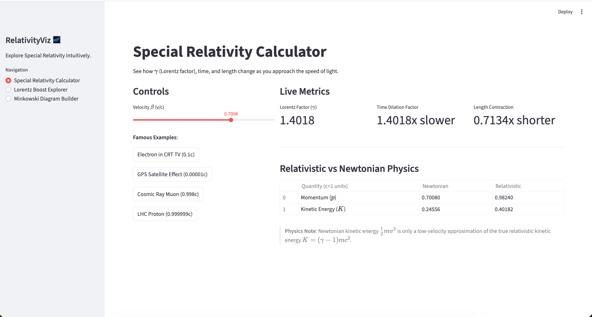
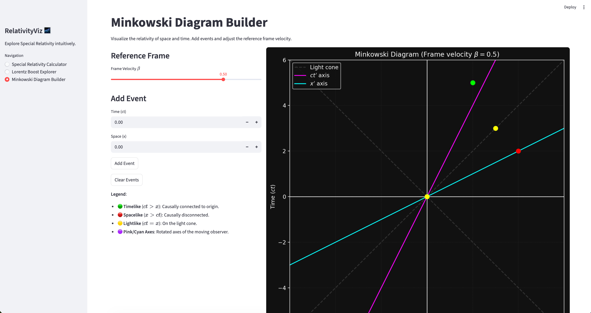
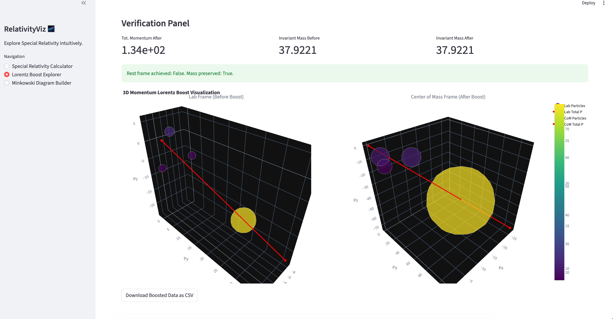

# RelativityViz 🌌\n\n## Dashboard Previews\n\n\n\n\n\"I built this while trying to truly understand special relativity beyond just memorizing formulas. The Lorentz boost was particularly confusing until I could visualize what it actually does to 4-vectors — so I built this tool."

## What this is

RelativityViz is an interactive, educational tool designed to help students and enthusiasts build an intuitive understanding of Special Relativity. It allows you to visualize Lorentz transformations, explore spacetime diagrams, and experiment with relativistic concepts.

## Why I built it

I built this project to bridge the gap between abstract mathematical formulas and physical intuition. The Lorentz boost matrix can seem like just a grid of numbers, but seeing how it geometrically transforms coordinates and mixing space and time makes the physics click. This is a passion project to solidify my own understanding and hopefully help others.

## Features

- **Special Relativity Calculator**: Interactive dashboard to see live updates of gamma, time dilation, length contraction, relativistic momentum, and kinetic energy based on variable speed.
- **Lorentz Boost Explorer**: A 3D interactive visualization showing how 4-vectors transform under active Lorentz boosts to different reference frames (e.g., the center-of-mass frame).
- **Minkowski Diagram Builder**: Interactive spacetime diagrams to visualize events, proper time, spacetime intervals, and the relativity of simultaneity.
- **Educational Notebooks**: A series of Jupyter notebooks walking through the mathematical derivation of Lorentz transformations to visualizing 4-vectors, written from the perspective of a physics student.

## Installation

To run the code locally, you need Python 3.10+ installed. Clone this repository and install the dependencies:

```bash
git clone https://github.com/yourusername/relativity-viz.git
cd relativity-viz
pip install -r requirements.txt
```

## Usage

**Interactive Dashboard (Streamlit)**
Run the main visualization application:

```bash
streamlit run app.py
```

**Educational Notebooks**
Launch Jupyter to explore the step-by-step lessons:

```bash
jupyter notebook
```

Then navigate to the `notebooks/` directory.

## Physics Covered

The core concepts visualize the transformations between inertial reference frames moving at relative velocity $v$ (in the $x$-direction for simplicity). Using natural units ($c=1$), the relative velocity is $\beta = v/c$. The Lorentz factor is:
$$ \gamma = \frac{1}{\sqrt{1 - \beta^2}} $$

### Lorentz Transformation (Boost along x-axis)

$$ \begin{pmatrix} ct' \\ x' \\ y' \\ z' \end{pmatrix} = \begin{pmatrix} \gamma & -\gamma\beta & 0 & 0 \\ -\gamma\beta & \gamma & 0 & 0 \\ 0 & 0 & 1 & 0 \\ 0 & 0 & 0 & 1 \end{pmatrix} \begin{pmatrix} ct \\ x \\ y \\ z \end{pmatrix} $$

### Invariant Mass

For a system of particles, the total 4-momentum $(E, p_x, p_y, p_z)$ has an invariant magnitude (squared):
$$ m^2 = E^2 - |\mathbf{p}|^2 $$
which is identical in all reference frames.

## What I learned building this

- How to derive general Lorentz boost matrices for arbitrary directions using vector projections.
- The power of working in the Center-of-Momentum (CoM) frame for analyzing multi-particle decays.
- Building engaging, state-driven interactive Python dashboards using Streamlit and Plotly.
- Bridging the analytical (abstract math) and the visual (geometric transformations in Minkowski space).

## References

1. Griffiths, D. J. _Introduction to Electrodynamics_.
2. Peskin, M. E., & Schroeder, D. V. _An Introduction to Quantum Field Theory_ (for conventions).
3. Einstein, A. (1905). _On the Electrodynamics of Moving Bodies_.
